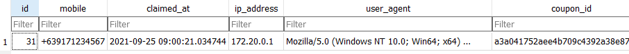

# Full-stack Dev Exercise - Promo Microsite

## Prerequisites:

### Edit environment variable files

[Backend env file](backend/core/.env)

```
SECRET_KEY=django-insecure-_(w*%ktha#uiu51h_38v!jz-wtzu68=n)nd0kb-#3=6=d5imb@
DEBUG=True
ALLOWED_HOSTS=*

TWILIO_ACCOUNT_SID=<Your twilio account SID>
TWILIO_AUTH_TOKEN=<Your twilio auth token>
TWILIO_PHONE_NUMBER=<Your twilio phone number>

RECAPTCHA_SITE_KEY=<Your google recaptcha site key>
RECAPTCHA_SECRET_KEY=<Your google recaptcha secret key>
```

[Frontend env file](frontend/scratchandwin/.env.local)

```
NEXT_PUBLIC_RECAPTCHA_SITE_KEY=<Your google recaptcha site key>
RECAPTCHA_SECRET_KEY=<Your google recaptcha secret key>
```

<strong>*Note*: This repo has .env files for the sake of testing, I already took down  the private keys, so if you want to run the app, you should supply your own keys.</strong>


## Running the app

### Via docker and docker-compose

```
docker-compose up
```

If there are any changes to the build file or the Dockerfiles, this command should be run prior to the app:

```
docker-compose build
```


### If docker is not installed

To run the API server

```
cd backend
python manage.py runserver
```

Note: By default, the API server runs at port 8000


To run the UI:

```
cd frontend/scratchandwin
yarn start
```

If there are any changes to the UI, this command should be run prior:

```
yarn build
```

Note: By default, the UI runs at port 3000

## Background

* An F&B client wanted to run a marketing-loyalty campaign wherein their packaged products will be distributed with a printed unique coupon code
* End-customers buying the packaged products may get this unique coupon code and  will be able to get a chance to win prizes
* Client wanted a web interface where customers can redeem their coupon code
* Prize is fixed and does not vary per coupon
* Client shall provide a list of winning coupons

### Data Modelling

#### Coupon Model
Model for a coupon object

##### **Fields**

* **public_id**

  UUID primary key

* **code**

  Required and Unique. 150 characters or fewer.
  
* **is_claimed**

  Boolean. Designates whether this has been claimed.

* **created_at**

  A datetime designating when the coupon was created. Is set to the current date/time by default when the coupon is created.

#### Promo Model
Model that represents an end-user or submission, hastily named Promo.

##### **Fields**

* **coupon**

  UUID one-to-one foreign key to a coupon object.
 
* **mobile**

  Required. Phone number of the end user.

* **claimed_at**

  A datetime designating when the coupon was claimed. Is set to the current date/time by default when the coupon is claimed.

* **ip_address**

  An IP address field that tracks an end-user IP address. Is set when a submission is made.

* **user_agent**

  A field that tracks an end-user's user agent. Is set when a submission is made.

A visual representation can be viewed at:
https://dbdiagram.io/d/614a5347825b5b01460d18fb

## Requirements

### Redeem a Coupon Form page


#### Form data:
* coupon code = alphanumeric
* mobile number = mobile number, philippine numbers (639xxyyyzzzz)

  

#### Logic and Constraints:
* submitted coupon code will be validated against an existing database of coupons
  
  [Example list](coupon.list)
  
* valid coupons mean they exist in the database  
* invalid coupon codes will be rejected

  
  
* valid coupon codes can only be claimed once

  

* a claimed coupon code is tied to a submission attempt entry
* a successful claim / redemption will get an SMS message
  
  
  
  The SMS messaging is implemented upon end-user entry:

  ```
    class Promo(models.Model):
      ...
       def save(self, *args, **kwargs):
        twilio_client.messages.create(
            body=f'You have successfully won a prize using coupon code: {self.coupon.code}. Please contact us to receive instructions to claim the prize.',
            from_=settings.TWILIO_PHONE_NUMBER,
            to=str(self.mobile)
        )
        return super().save(*args, **kwargs)
  ```
  
  Delivered Twilio message
  
  
  
  
  <strong>*Note*: Only verified numbers can receive messages from twilio. Since I am using a trial account, this app can only send messages to verified numbers.</strong>
  
  
* implement rate limit of attempts per IP-address

  
  
* use captcha also if possible to prevent bots

  

#### Data:

* coupons are hashed

  Coupons are hashed after creation:

  ```
    @receiver(post_save, sender=Coupon)
    def hash_coupon_code(sender, instance, created, **kwargs):
      # Hash coupon code upon creation
      if created:
          instance.code = hash_string(instance.code)
          instance.save()
  ```
  
  Example
  
  

* The following are logged:
		timestamp, mobile, coupon, ip address, user agent
    
    
